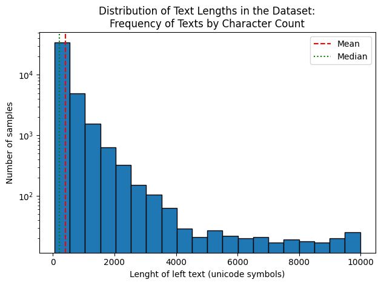
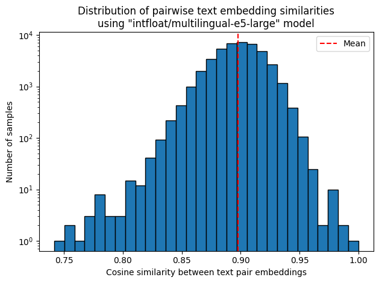

# Parallel Literary Corpora: Fiction and Poetry Translations

This repository provides high-quality parallel datasets for translating fiction and poetry between Russian and various foreign languages.

## Key Features

- **Paragraph-level alignment**: Unlike typical parallel corpora, this dataset avoids sentence-level alignment to better reflect literary translation practices. In fiction and poetry, translators often work with larger textual units (paragraphs, stanzas, or passages) rather than individual sentences.
- **Diverse languages**: Covers multiple languages with emphasis on English and German translations.

## Dataset Structure

### Current Version: Fiction Translations

File: [`prose_translation_pairs.public.jsonl.gz`](prose_translation_pairs.public.jsonl.gz)  
Samples: 42,621  
Format: gzip'ed JSON lines

Each entry contains:
- `left_text`: Source text (non-Russian literary passage)
- `left_language`: Source language name
- `right_text`: Russian translation
- `domain`: Always "prose" in current version

## Data Statistics

### Text Length Characteristics
**Left text length (characters):**
- Min: 51
- Max: 9,982
- Average: 408



### Language Distribution
| Language           | Samples  | Percentage |
|--------------------|----------|------------|
| English            | 23,114   | 54.23%     |
| German             | 19,370   | 45.45%     |
| French             | 76       | 0.18%      |
| Spanish            | 27       | 0.06%      |
| Slovenian          | 12       | 0.03%      |
| Catalan            | 10       | 0.02%      |
| Polish             | 7        | 0.02%      |
| Danish             | 2        | <0.01%     |
| Chinese            | 1        | <0.01%     |
| Persian            | 1        | <0.01%     |
| Dutch              | 1        | <0.01%     |

### Semantic Similarity Analysis
Text pairs were embedded using the [multilingual-e5-large](https://huggingface.co/intfloat/multilingual-e5-large) model. The histogram below shows the distribution of cosine similarity scores between source texts and their Russian translations:



## Intended Use Cases

This dataset is designed to support research and development in the following areas:

##### 1. Machine Translation (MT)
- Training and evaluating **literary-aware MT systems** that handle paragraph-level context
- Studying **translation style transfer**
- Developing **domain-adapted models** for fiction and poetry

##### 2. Computational Creativity
- Analyzing **creative translation choices** (e.g., metaphors, cultural adaptations)
- Generating **literary-aware paraphrases**  
- Studying **cross-lingual stylistic patterns**

##### 3. Large Language Models
- Fine-tuning for **literary text generation**
- Evaluating **cross-lingual coherence** in long-form text
- **Few-shot learning** for low-resource literary languages

## Future Additions
- Poetry translation pairs
- Expanded language coverage
- Additional metadata (author, period, genre)


### **Limitations**
- Not suitable for sentence-level MT tasks without realignment
- Biased toward English/German translations (see [Language Distribution](#data-statistics))
## Ethical Considerations  
- Contains artistic works: Cite original authors where possible  
- Verify licensing status of source texts before commercial use

## Citation
If you use this dataset, please cite as:
```bibtex
@misc{koziev_translations,
  author       = {Koziev},
  title        = {Parallel Literary Corpora: Fiction and Poetry Translations},
  year         = {2023},
  howpublished = {GitHub repository},
  publisher    = {GitHub},
  journal      = {GitHub repository},
  url          = {https://github.com/Koziev/Translations},
  note         = {Paragraph-aligned parallel texts for literary translation between Russian and multiple languages}
}
```

